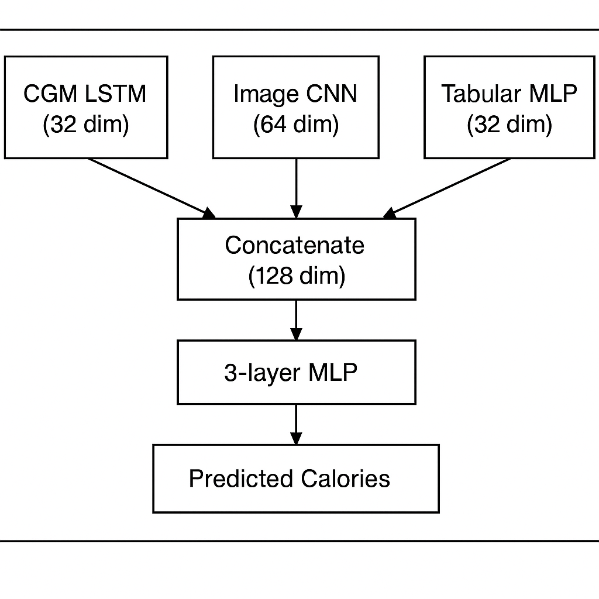

# 🍽️ Calorie Estimation using Multimodal Data

This project is a deep learning system that estimates the **calories in a meal** using **multimodal inputs**:

- 🖼️ Food Image
- 📊 Continuous Glucose Monitoring (CGM) Data
- 🧍 Demographic Information (e.g., age, gender)

The model combines computer vision, time-series, and tabular data into a single architecture to predict calorie content in real-time.

---

## 🚀 Project Overview

Traditional calorie estimation apps rely solely on image classification. This project improves prediction by combining three data sources:

- **CNN** extracts features from the food image.
- **BiDirectional-LSTM** processes CGM time-series data.
- **MLP** handles demographic inputs.
- The outputs are fused and passed through dense layers for final calorie prediction.

## Architecture

---

## 📦 Requirements

Install dependencies:

Make sure your Python version is 3.8+ and that you have:

- PyTorch
- torchvision
- pandas
- numpy
- matplotlib
- pillow
- scikit-learn

---

## 🧠 Key Features

- ✅ Real-world CGM + image fusion
- ✅ Modular architecture (easy to plug in other modalities)
- ✅ Lightweight and fast for prototyping

---

## 📊 Results

- Achieved **0.26 RMRSE** compared to image-only models.
- Demonstrated robustness to noisy glucose data.

---

## 📚 Future Work

- Add mobile-friendly inference API
- Expand dataset with annotated food images
- Incorporate BMI and activity level for richer predictions
